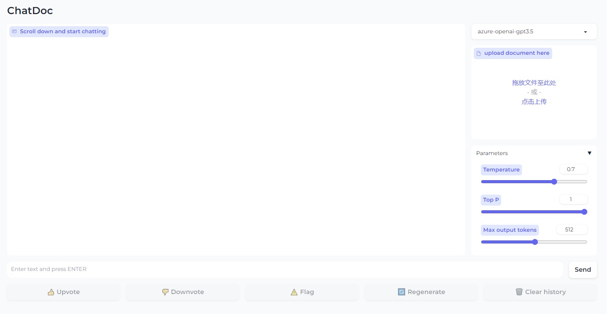
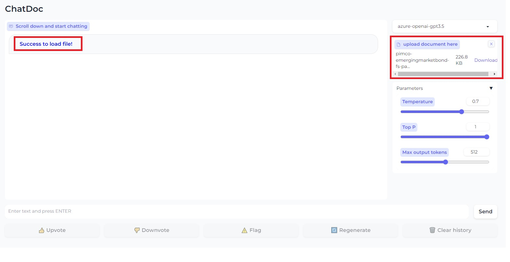
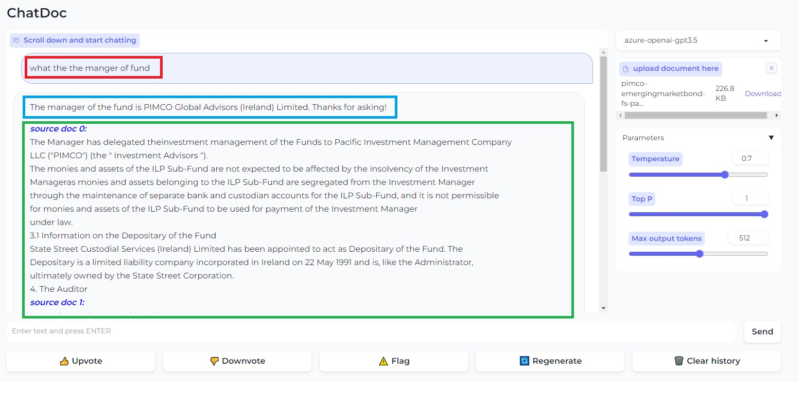

# ChatDoc
chat with pdf and other docuemnts which can be extracted to text

# run the webui
1. prepare the virtual env
```shell 
conda create -n chatdoc_env python==3.9.16  
conda activate chatdoc_env  
pip install -r requirements.txt    
```


2. run the webui server

```shell  
cd src  
```

```python  
python webui.py  
```



3. upload the pdf and process the pdf



4. ask the question and get the answer  




# server configs
src/configs/config.py
